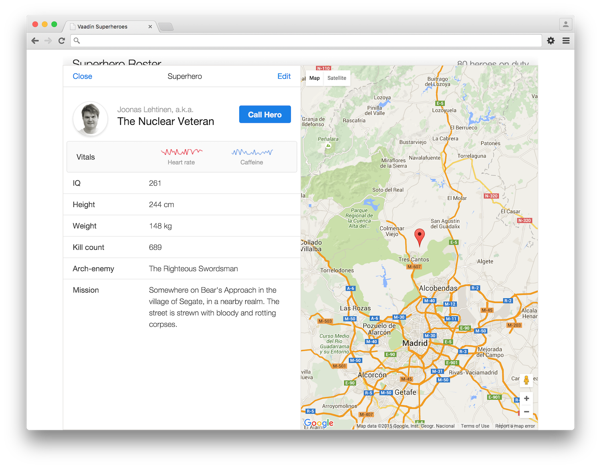

# Superhero Demo project for Vaadin Elements



To run the demo application:
```
$ bower install
$ serve .
```
Then open [http://localhost:3000](http://localhost:3000/index.html)

If you do not have Bower, see its installation [instructions](http://bower.io/#install-bower).

If you do not have Serve, deploy the files using any HTTP server or
install [serve](https://www.npmjs.com/package/serve).

Note that opening the files locally won't work because browsers tend
to block HTML imports from file:// URLs.
